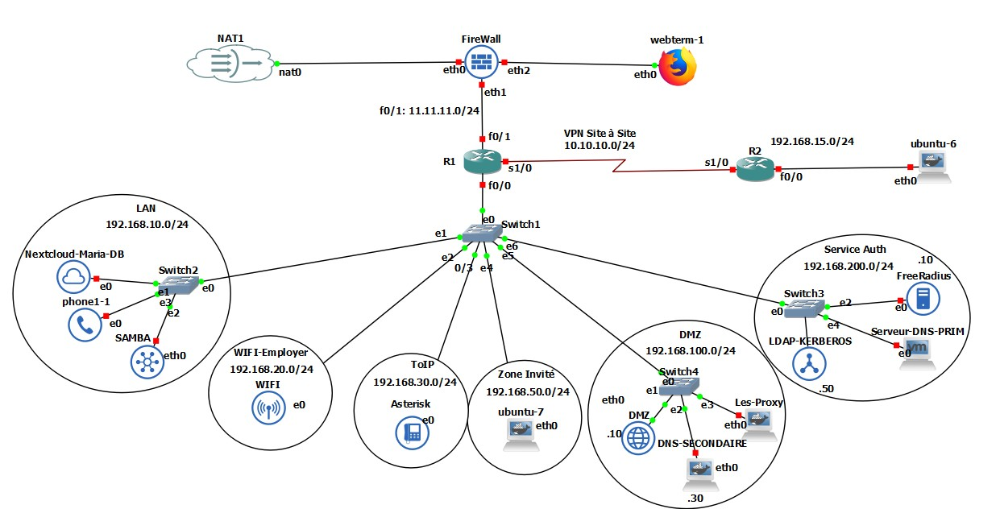

# Projet de Fin de Module – Administration et Sécurité d’un Réseau Local

## Notre Architecture 

## 📌 Objectif général
Ce projet consiste à déployer une **infrastructure réseau sécurisée** pour l’entreprise fictive **SMARTTECH**, intégrant plusieurs zones logiques et services critiques.  
L’accent est mis sur la **sécurité**, l’**authentification centralisée** et la **supervision**.

---

## 🗂 Architecture réseau

- **DMZ** : Services publics et filtrés (Web, DNS, Proxy)
- **LAN** : Services internes (Nextcloud, base de données, fichiers, SIP)
- **VPN** : Accès distant sécurisé vers le LAN
- **ToIP** : Téléphonie interne SIP
- **Wi-Fi** : Accès employé via authentification RADIUS
- **Invités** : Accès Internet uniquement via proxy
- **Services d’authentification** : LDAP, Kerberos, FreeIPA, FreeRADIUS

---

## 🔧 Services déployés

### DMZ
- Serveur Web public (Apache/Nginx)
- DNS secondaire
- Proxy HTTP/HTTPS (Squid)
- Proxy DNS (dnsmasq ou Bind)

### LAN
- Intranet (Nextcloud) avec authentification LDAP/Kerberos
- Base de données (PostgreSQL ou MariaDB)
- Serveur de fichiers (Samba/NFS)
- Serveur SIP (Asterisk)

### Authentification
- OpenLDAP : gestion des comptes et groupes
- Kerberos : authentification sécurisée (SASL/GSSAPI)
- FreeIPA ou couplage OpenLDAP + Kerberos
- FreeRADIUS relié à LDAP/Kerberos

### VPN et sécurité
- OpenVPN ou IPsec StrongSwan
- Authentification par RADIUS ou certificat
- Pare-feu nftables (politique DROP par défaut, NAT, VLANs, journalisation)

### ToIP
- Serveur SIP (Asterisk ou FreeSWITCH)
- Softphones (Zoiper, Linphone)
- Enregistrement via LDAP + appels test

### Surveillance & logs
- auditd : suivi des accès aux fichiers sensibles
- rsyslog ou syslog-ng
- Suivi des journaux RADIUS, Kerberos, authentification

---

## 📄 Livrables
- **Rapport** : architecture, configurations, résultats des tests
- **Schéma réseau** : zones, adresses IP, VLANs, flux filtrés
- **Configurations** : nftables, RADIUS, VPN, LDAP, Kerberos, SIP
- **Captures/tests** : connexions VPN, authentifications RADIUS, appels SIP, logs auditd
- **Scripts** : installation et test automatisés
- **Présentation** : synthèse du projet

---

## 📬 Contact
Projet réalisé dans le cadre du module **Administration et Sécurité d’un Réseau Local** – **L3 DSTI** (2024-2025)  
**Université Amadou Mahtar Mbow – Polytech Diamniadio**
